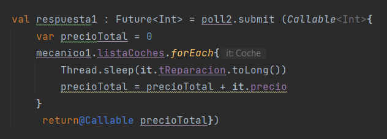

# Explicación y resumen
## Hilos:
Los hilos (también conocidos como threads) son una unidad básica de ejecución en un programa informático. Un hilo se puede ver como una secuencia de instrucciones que se ejecutan de forma concurrente con otros hilos dentro de un mismo proceso. Los hilos permiten que varias partes de un programa se ejecuten simultáneamente, lo que puede mejorar significativamente el rendimiento y la capacidad de respuesta de una aplicación.
### ejemplo:
poll.submit { espacio para tareas a hacer en el hilo }

## Poll de hilos
ExecutorService es una interfaz en Java que proporciona métodos para ejecutar y controlar hilos en segundo plano. La implementación de esta interfaz más comúnmente utilizada es ThreadPoolExecutor. Un ThreadPoolExecutor crea un grupo de hilos y administra su uso para que no se creen y se destruyan hilos continuamente. En su lugar, los hilos se reutilizan para ejecutar tareas adicionales.

ExecutorService proporciona varios métodos para enviar tareas para su ejecución en los hilos del ThreadPoolExecutor. Uno de estos métodos es submit(), que se utiliza para enviar una tarea para su ejecución y devuelve un objeto Future. Un objeto Future representa el resultado futuro de una tarea, lo que significa que se puede utilizar para recuperar el valor devuelto por una tarea que se está ejecutando en segundo plano. El método submit() admite tanto tareas Runnable como Callable.

poll() es un método de la clase ExecutorService que se utiliza para verificar si todas las tareas enviadas para su ejecución han finalizado. El método devuelve true si todas las tareas han finalizado y false en caso contrario.

El método awaitTermination() es otro método de ExecutorService que se utiliza para esperar a que todas las tareas enviadas para su ejecución se completen. Este método bloquea la ejecución del hilo actual hasta que todas las tareas se completen o hasta que se alcance un tiempo máximo de espera. El método acepta dos argumentos: el tiempo máximo de espera y la unidad de tiempo.
### ejemplo: 
- var poll = Executors.newFixedThreadPool(3)
- poll.shutdown()
- poll.awaitTermination(2000L, TimeUnit.MILLISECONDS)

## Runnable:
Runnable es una interfaz funcional en Java que se utiliza para definir tareas que se pueden ejecutar en un hilo. Una tarea que implementa la interfaz Runnable no devuelve ningún valor, por lo que se utiliza cuando simplemente necesitas ejecutar una tarea en segundo plano sin esperar ningún resultado. Para ejecutar una tarea Runnable, se debe crear un objeto Thread y pasarle la tarea como argumento al constructor del objeto. El método run() de la tarea se ejecutará cuando se inicie el hilo.

## Thread:
Thread es una clase en Java que se utiliza para crear y controlar hilos. Para crear un hilo, se debe crear un objeto Thread y pasarle una tarea (que implemente la interfaz Runnable) como argumento al constructor del objeto. El hilo se inicia con el método start() del objeto Thread. El método run() de la tarea se ejecutará cuando se inicie el hilo. Además, la clase Thread proporciona métodos para controlar el estado y el comportamiento del hilo, como sleep(), join() y interrupt().

## Callable:
Callable es una interfaz funcional en Java que se utiliza para definir tareas que se pueden ejecutar en un hilo y que devuelven un valor. A diferencia de la interfaz Runnable, la interfaz Callable tiene un método call() que devuelve un valor. Para ejecutar una tarea Callable, se debe crear un objeto FutureTask y pasarle la tarea como argumento al constructor del objeto. El objeto FutureTask implementa la interfaz Future, que se puede utilizar para recuperar el valor devuelto por la tarea cuando se completa la ejecución. El método call() de la tarea se ejecutará cuando se inicie el hilo.
### ejemplo:

